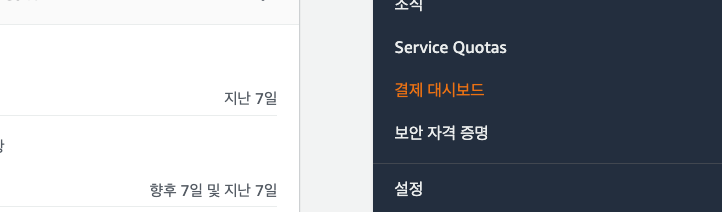
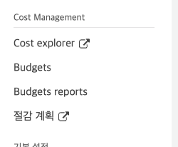
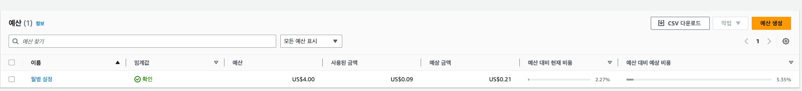
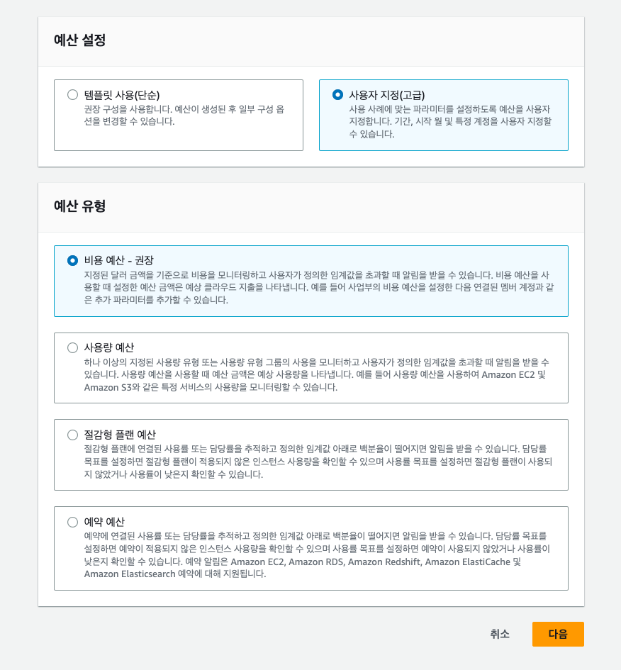
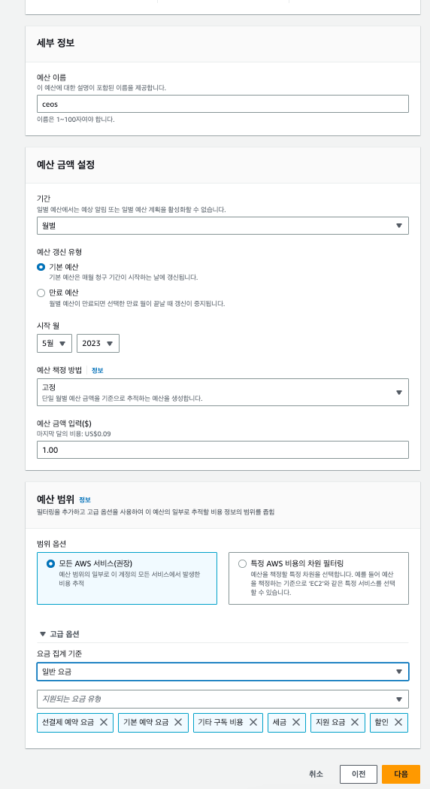
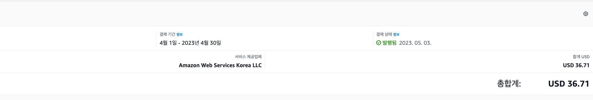
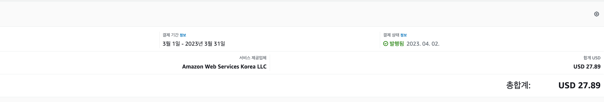

# CEOS 17기 백엔드 스터디

## 서비스 요구사항

이번 과제로 작성한 프로그램의 요구사항은 크게 학교기능 ,유저기능, 게시판 그리고 시간표 기능으로 나뉜다.
이후에 각 가능은 다음과 같은 기능을 구현해야한다.

### 전체 기능

* 학교를 구분할 수 있어야 한다.
* 학과를 구분할 수 있어야 한다.

### 유저 기능

* 회원가입
* 별명 설정
* 친구 추가
* 가입일자

### 게시판

* 글 쓰기
* 댓글 쓰기
* 대댓글 기능
* 익명 기능
* 질문글 기능
* 댓글 수정 기능
* 댓글 삭제 기능
* 댓글 읽기 기능
* 글 종아요 기능
* 글 신고 기능
* 글 스크랩 기능
* 댓글 좋아요 기능
* 댓글 신고 기능

### 시간표

* 시간표 추가 기능
* 시간표 공개 여부
* 시간표 과목 추가
* 과목 별점
* 과목 교수 조회

## ERD 모델

이 과제의 ERD 모델은 다음과 같다.

## ORM 사용

ORM 명령어로 3개의 학교를 넣은 뒤 objects.all 명령어를 사용해서 학교를 전부 조회하였다.

이후에 objects.filter를 사용해서 sogang이라는 이름을 가진 학교를 조회한다.

## 과제를 하면서 알게된 정보와 오류 수정과정

### User

* 처음에는 너무 귀찮아서 AbstractUser를 상속받아서 원래 상속된 필드를 그대로 받는 방식으로 하였다.
* 하지만 지원이가 User기능을 구현하려는 것을 보고 이대로 살면 안되겠다는 생각과 함께 결국 AbstractUser가 아닌 AbstractBaseUser를 상속받아서 유저를 구현하는 것으로 방식을 전환하였다.
* 솔직히 구현하는데 좀 짜증나긴했음
* 구조는 다음과 같다.

~~~python
class User(AbstractBaseUser, PermissionsMixin):
    objects = UserManager()
~~~

으로 2개의 class를 상속 받은 이후에
objects 변수에 UserManger를 실행해서 object를 초기화를 한다.

UserManager를 구현하는 방식은 다음과 같다.

~~~python

class UserManager(BaseUserManager):

    def create_user(self, username, password, nickname, **extra_fields):
        pass

    def create_superuser(self, username, password, nickname=None):
        pass
~~~

create_user 함수와 create_superuser함수를 구현해서 일반 유저 생성과 superuser생성하는 함수를 구현한다.

이후에는 자신이 원하는 필드를 추가하면 완성!

마지막으로 manage.py에서
AUTH_USER_MODEL 를 설정하고 자신의 user class의 위치를 가리키면 앱에서 돌아갈 준비가 완료된 것이다.

### 기타

* migration을 할 때는 app마다 migration을 진행해야 한다.
* 솔직히 migration 잘못해서 골치가 아픈 경우가 많고, 개발 단계이므로

~~~shell
find . -path "*/migrations/*.py" -not -name "__init__.py" -delete
find . -path "*/migrations/*.pyc"  -delete
pip install --upgrade --force-reinstall Django
~~~

를 입력한 이후에 mysql 로 들어가서 프로젝트를 위한 테이블을 찾은 이후에

~~~mysql
DROP DATABASE (데이터베이스 이름)
CREATE DATABASE (데이터베이스 이름)
~~~

을 해주면 충돌 없이 수정 사항을 다시 적용할 수 있다.

역시 밀어버리는 방식이 너무 속 편하다.

* 그래도 미는 것이 별로 좋은 방법은 아니므로 makemigration을 그냥 치는거보다는 make migrations (앱 이름)을 해주도록 하자
* ID 필드를 설정할 때는 일반 primary key 보다는 UUID를 활용하는 것이 좋다. [링크](https://stir.tistory.com/294) 모든 기술에는 장점과 단점이 있으니 잘 판단해서 사용하자
* 클래스 내에 Meta 라는 클래스를 선언하여 모델의 기타 작동 방식을 정의 할 수 있다.
* global_entity/models에서 BaseEntity를 선언하여서 Meta값에 abstract=True라고 해서 상속 가능하게 클래스를 변경하였다.
* edittable=False로 진행하면 django 페이지에서 값을 주지 못한다.
* 장고에서 객체의 primary키 이름은 설정하지 않는다면 클래스 이름을 모두 소문자로 나타낸 값이다.
* 하지만 나중에 외래키를 사용하는 과정에서 이름 충돌이 나기 시작하고 db이름을 쓰는 convention에 따라서 primary key값을 클래스이름_id와 같은 방식으로 선언하였다.
* primary_key를 설정할 때는 AutoField를 이용해서 설정해준다.

## 회고

* erd 테이블을 짤 때 상당히 고전했고, 유저를 만드는 과정에서 상당히 고생하였다.
* 이번에 기능을 완성할 때 마다 readme를 작성하지 않아서 문제가 생긴 부분이 어디인지 잘 기억이 나지 않았다.
* 다음에는 기록 잘하자!

## step CBV

이와 같이 모든 정보를 가져오는 api 를 구현하였다.

또한 모든 정보를 가져오는 url 이외에도 pk를 통해서 특정 정보를 가져오는 api, 특정 정보를 삭제하는 api, 특정 정보를 수정하는 api를 구현하였다.

~~~python
urlpatterns = [
    path('', views.AllBoardView.as_view(), name='all_board'),
    path('<int:pk>/', views.OneBoardView.as_view(), name='index'),
    # path('<int:pk>/', views.DetailView.as_view(), name='detail'),
    # path('<int:pk>/results/', views.ResultsView.as_view(), name='results'),
    # path('<int:question_id>/vote/', views.vote, name='vote'),
]
~~~

## step ViewSet

그러나 viewSet으로 수정했을 때는 끝내 실패했다.
왜 이런지는 모르겠지만, 다른 사람들의 실습을 보면서 참고를 할 예정이다.

추정되는 이유로는

~~~python
filter_backends = [DjangoFilterBackend]
filterset_class = BoardFilter
~~~
를 설정했는데 여기에서 BoardFilter 클래스로 정상적으로 입력이 가지 않는 것이 원인인것 같다.

## 알게 된 점

* 장고 adminpage에서 유저 정보를 저장할 때는 password encrypt가 발생하지 않는다.
* as_view 메서드는 해당 클래스가 모든 것을 알아서 하게 놔둔다는 의미를 지닌다.
* ModelViewSet 은 ixins.CreateModelMixin, mixins.RetrieveModelMixin, mixins.UpdateModelMixin, mixins.DestroyModelMixin,
  mixins.ListModelMixin, GenericViewSet 를 상속한다. 이상적인 것은 get, post, put 연산에 따라서 상속을 받는 방법이 제일 이상적이다.
* delete 연산을 할 때는 perform_destroy 메서드를 오버라이딩해서 delete 연산을 커스터마이징이 가능하다.
* filterset_class는 filter를 해주는 class이고, filterset_fields는 filter를 해주는 field이다. 후자가 훨씬 구현에서는 이득을 가진다.
* filter는 주로 문자 이외에 모든 것을 다루고, search는 주로 문자를 다룬다.
* viewSet은 미스터리인거 같다.

# 추가적인 JWT_AUTH 설정
~~~PYTHON
SIMPLE_JWT = {
    'ACCESS_TOKEN_LIFETIME': timedelta(minutes=30),
    'REFRESH_TOKEN_LIFETIME': timedelta(days=7),
    'ROTATE_REFRESH_TOKENS': False,
    'BLACKLIST_AFTER_ROTATION': False,
    'UPDATE_LAST_LOGIN': False,

    'ALGORITHM': 'HS256',
    'SIGNING_KEY': SECRET_KEY,
    'VERIFYING_KEY': None,
    'AUDIENCE': None,
    'ISSUER': None,
    'JWK_URL': None,
    'LEEWAY': 0,

    'AUTH_HEADER_TYPES': ('Bearer',),
    'AUTH_HEADER_NAME': 'HTTP_AUTHORIZATION',
    'USER_ID_FIELD': 'username',
    'USER_ID_CLAIM': 'username',
    'USER_AUTHENTICATION_RULE': 'rest_framework_simplejwt.authentication.default_user_authentication_rule',

    'AUTH_TOKEN_CLASSES': ('rest_framework_simplejwt.tokens.AccessToken',),
    'TOKEN_TYPE_CLAIM': 'token_type',
    'TOKEN_USER_CLASS': 'rest_framework_simplejwt.models.TokenUser',

    'JTI_CLAIM': 'jti',

    'SLIDING_TOKEN_REFRESH_EXP_CLAIM': 'refresh_exp',
    'SLIDING_TOKEN_LIFETIME': timedelta(minutes=5),
    'SLIDING_TOKEN_REFRESH_LIFETIME': timedelta(days=1),
}
~~~

* 여기에서 user_id_field 에서 USER_ID_FIELD, 디비에서 보는 부분이고, USER_ID_CLAIM 은 토큰에 필드로 넣어주는 부분이다.

~~~python
user = authenticate(username=request.data.get("username"), password=request.data.get("password"))
~~~

* 요청에서 받아온 body에 있는 username과 password를 받아서 authenticate 함수에 넣어준다. 로그인이 완료되면 user라는 객체를 반환한다.

## Q1 로그인 인증은 어떻게 하나요? & Q2 JWT는 무엇인가요?

로그인은 크게 2가지 개념으로 구성 되어있다.

1. 인증(Authentication)
    * 사용자가 누구인지 확인하는 절차
2. 인가(Authorization)
    * 사용자를 식별하고 인증된 사용자에게만 권한을 부여하는 절차
    * 자원의 접근에 대한 허가라고 생각하면 된다.

이런 로그인 과정을 매번 사용자가 접속할 때 마다 수행하는 것은 매번 암호화 연산을 수행하는 만큼 비효율적이다.
그래서 세션과 쿠키와 같은 방법을 사용해서 

* 쿠키 & 세션
    쿠키는 클라이언트(브라우저) 로컬에 저장되는 작은 데이터 파일을 말하고, 세션은 세션ID를 통해서 로그인 되어있음을 지속하는 상태를 말한다. 
    인증된 사용자의 식별자와 랜덤한 문자열로 세션 ID를 만들어서 서버에 저장하고 응답헤더에 넘겨서 클라이언트가 저장할 수 있게 한다. 그리고 쿠키에 저장을 하고 있다가 다음 로그인  때 해당 세션 id를 넘긴다.

* JWT
    하지만 세션은 서버의 database를 조회하는 방식으로 서버에 무리를 줄 수 있어서 상태가 존재하지 않는 JWT 토큰을 사용한다.
    이 때 토큰이 탈취 당하게 된다면, 악의적인 사용자에 의해서 지속적으로 사용당할 수 있으므로, 토큰의 유효기간을 짧게 설정해야 한다.

## 5주차 과제 

### 인바운드 규칙

* 인바운드 규칙이라는 것은 외부에서 들어오는 트래픽을 어떻게 처리할 것인지에 대한 규칙이다.
* 이상적인 ec2 기준으로 인바운드 규칙은 22번 포트는 자신 집 주소로 ip로 설정하고 (현재 대부분 가정집의 ip 주소는 dhcp이기 때문에 ip가 바뀔 수도 있다는 점은 유의하여야 한다.), database 포트는 자신의 rdb 서버만 허용한다.
* 이후에 rdb의 3306 인바운드 서버는 자신의 ec2 서버와 자신이 사용할 ip 주소만 허용한다.

### sudo docker exec -it 81e6879cb988 python manage.py migrate

* 운영진의 의도는 /config/scripts/deploy.sh에 python manage.py makemigrations && python manage.py makemigrations 를 추가하라는 의도였지만 
* ec2에서 도커에 들어가서 실행하였다...ㅎㅎ
* docker를 이용해서 내부에 들어가서 create superuser를 해주어서 로그인을 할 수 있게 하였다.

### RDS 세팅

* rds는 꼭 인터넷에 나와있는 프리티어 세팅을 잘 맞추도록 한다.
* [링크](https://velog.io/@shawnhansh/AWS-RDSmySql-%ED%94%84%EB%A6%AC%ED%8B%B0%EC%96%B4-%EC%83%9D%EC%84%B1%ED%95%98%EA%B8%B0) 를 참고하면 좋다.
* 중요한 점은 파라미터 그룹 생성 이후에 rds 재시작을 하여서 파라미터 그룹이 잘 적용되게 해줘야한다. 

### aws 비용 경고

여기에서 결제 대시 보드를 들어간다.

여기에서 Budgets에 들어간다.

예산 생성에 들어간다.

사용자 지정을 -> 비용 예상을 선택한다.

월별 예산으로 선택한다.

## 절대!

## 제가 총합 8만원 가량을 날린게 화가 나서 쓴게 아닙니다 ^^

aws 비용 경고는 꼭 켜둡시다...

### 도커

[링크](https://subicura.com/2017/01/19/docker-guide-for-beginners-1.html)

위의 글을 보고 처음 시작하기 좋습니다. 

* [링크](https://velog.io/@kshired/Docker-%EC%BB%A8%ED%85%8C%EC%9D%B4%EB%84%88%EC%97%90%EC%84%9C-localhost%EC%99%80-%ED%86%B5%EC%8B%A0%ED%95%98%EA%B8%B0)
* 이번 프로젝트에서는 db 컨테이너를 만들었지만 굳이 localhost에 존재하는 mysql을 사용하는 사람들을 위한 글입니다. 도커는 localhost와 통신할 때 주의를 해서 설정을 하셔야합니다.

### nginx

* nginx는 리버스 포록시 서버, 로드벨런서의 일종으로 사용자가 요청을 하면 해당 요청을 부하를 분산해서 서버에 전달을 해주는 역할을 담당한다.

### 리버스 프록시란?

* 포워드 프록시의 반대말로써 포워드 프록시는 우리가 흔히 생각하는 프록시가 맞다.
* 그거와 반대로 클라이언트가 특정 서버를 접속할 때 서버 정보를 숨길 수 있다는 장점이 존재한다. 포워드 프록시는 클라이언트의 정보가 숨겨진다.
* 리버스 프록시는 서버의 정보가 숨겨진다는 점이 차이점이다.

#### 리버스 프록시를 쓰는 이유

* 캐싱
  * 클라이언트의 요청을 캐싱해서 동일한 요청이 들어오면 그대로 정해진 정보를 내보내 줄 수 있다.ㄴ
* 보안
  * 클라이언트들은 진짜 서버에 요청을 하는 것이 아니라, reverse proxy 서버가 진짜 서버 주소라고 생각해서 해당 서버에 요청을 한다.
* Load balancing

#### 로드 밸런싱

* 로드 밸런싱은 여러 서버에 부하를 분산시켜주는 역할을 한다. 이 과정에서 scale out을 실현할 수 있게 된다. (scale up은 서버 성능을 좋게 만드는 것이고, scale out은 서버를 여러대 구매를 하는 것이다.)

* 로드 밸런싱은 크게 L4와 L7을 사용한다. L4는 port 기반으로 분산을 하고, L7은 http 요청을 기반으로 분산을 한다.

### 궁금한점 

* [링크](https://velog.io/@hax0r/AWS-ECSECR-%EC%9D%84-%ED%86%B5%ED%95%9C-%EC%84%9C%EB%B9%84%EC%8A%A4-%EB%B0%B0%ED%8F%AC#codepipeline)
* ecs를 이용해서 도커를 배포하는 것이, ec2에서 코드를 동기화 시켜서 도커를 빌드해서 배포하는 것에 비해서 어떤 장점을 가지는지 의문
* 아는 분들 코멘트 좀여...
* 친구한테 물어보니 ecr을 사용하면 이미지 빌드가 1번만 일어나서 좋고, 이미지가 잘못 되었을 경우, 이미지 자체를 롤백해서 실행하는 것이 가능해서 좋다고 했음
