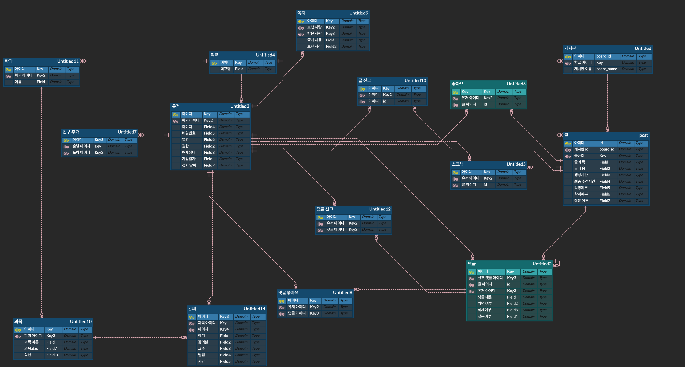
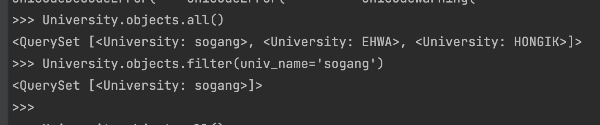
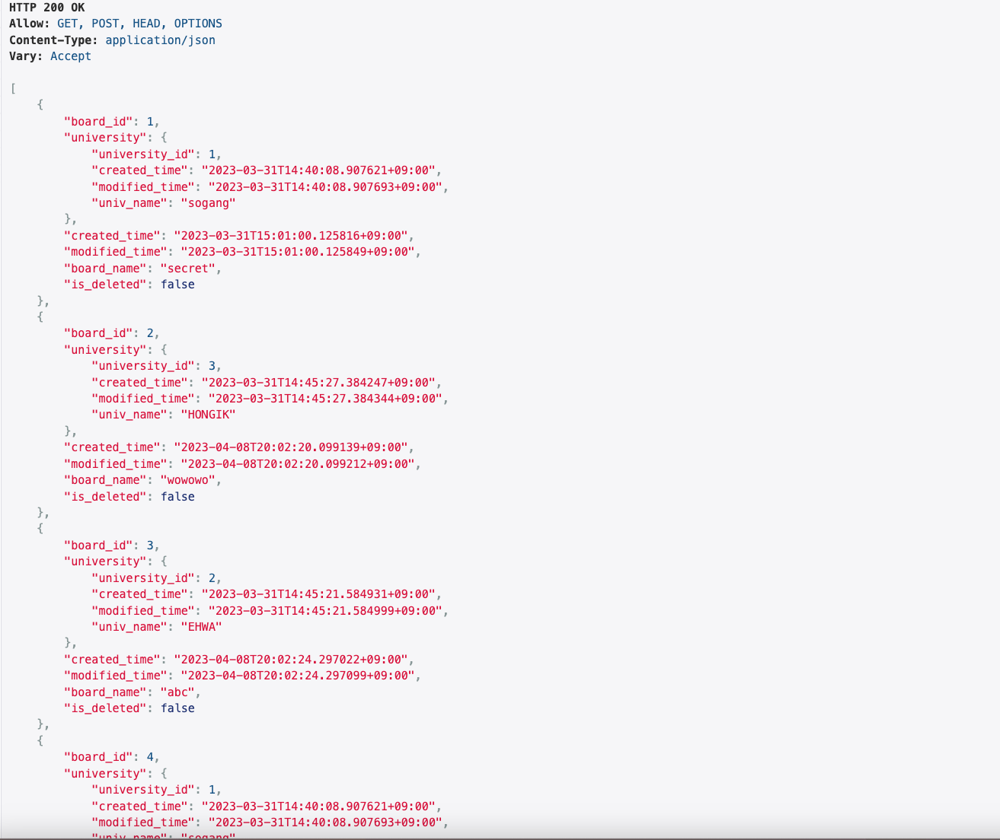
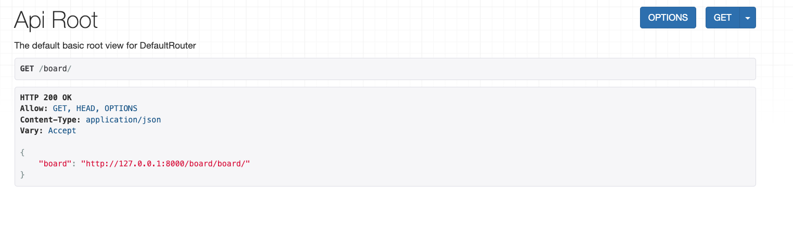

# CEOS 17기 백엔드 스터디

## 서비스 요구사항

이번 과제로 작성한 프로그램의 요구사항은 크게 학교기능 ,유저기능, 게시판 그리고 시간표 기능으로 나뉜다.
이후에 각 가능은 다음과 같은 기능을 구현해야한다.

### 전체 기능

* 학교를 구분할 수 있어야 한다.
* 학과를 구분할 수 있어야 한다.

### 유저 기능

* 회원가입
* 별명 설정
* 친구 추가
* 가입일자

### 게시판

* 글 쓰기
* 댓글 쓰기
* 대댓글 기능
* 익명 기능
* 질문글 기능
* 댓글 수정 기능
* 댓글 삭제 기능
* 댓글 읽기 기능
* 글 종아요 기능
* 글 신고 기능
* 글 스크랩 기능
* 댓글 좋아요 기능
* 댓글 신고 기능

### 시간표

* 시간표 추가 기능
* 시간표 공개 여부
* 시간표 과목 추가
* 과목 별점
* 과목 교수 조회

## ERD 모델

이 과제의 ERD 모델은 다음과 같다.

## ORM 사용

ORM 명령어로 3개의 학교를 넣은 뒤 objects.all 명령어를 사용해서 학교를 전부 조회하였다.

이후에 objects.filter를 사용해서 sogang이라는 이름을 가진 학교를 조회한다.

## 과제를 하면서 알게된 정보와 오류 수정과정

### User

* 처음에는 너무 귀찮아서 AbstractUser를 상속받아서 원래 상속된 필드를 그대로 받는 방식으로 하였다.
* 하지만 지원이가 User기능을 구현하려는 것을 보고 이대로 살면 안되겠다는 생각과 함께 결국 AbstractUser가 아닌 AbstractBaseUser를 상속받아서 유저를 구현하는 것으로 방식을 전환하였다.
* 솔직히 구현하는데 좀 짜증나긴했음
* 구조는 다음과 같다.

~~~python
class User(AbstractBaseUser, PermissionsMixin):
    objects = UserManager()
~~~

으로 2개의 class를 상속 받은 이후에
objects 변수에 UserManger를 실행해서 object를 초기화를 한다.

UserManager를 구현하는 방식은 다음과 같다.

~~~python

class UserManager(BaseUserManager):

    def create_user(self, username, password, nickname, **extra_fields):
        pass

    def create_superuser(self, username, password, nickname=None):
        pass
~~~

create_user 함수와 create_superuser함수를 구현해서 일반 유저 생성과 superuser생성하는 함수를 구현한다.

이후에는 자신이 원하는 필드를 추가하면 완성!

마지막으로 manage.py에서
AUTH_USER_MODEL 를 설정하고 자신의 user class의 위치를 가리키면 앱에서 돌아갈 준비가 완료된 것이다.

### 기타

* migration을 할 때는 app마다 migration을 진행해야 한다.
* 솔직히 migration 잘못해서 골치가 아픈 경우가 많고, 개발 단계이므로

~~~shell
find . -path "*/migrations/*.py" -not -name "__init__.py" -delete
find . -path "*/migrations/*.pyc"  -delete
pip install --upgrade --force-reinstall Django
~~~

를 입력한 이후에 mysql 로 들어가서 프로젝트를 위한 테이블을 찾은 이후에

~~~mysql
DROP DATABASE (데이터베이스 이름)
CREATE DATABASE (데이터베이스 이름)
~~~

을 해주면 충돌 없이 수정 사항을 다시 적용할 수 있다.

역시 밀어버리는 방식이 너무 속 편하다.

* 그래도 미는 것이 별로 좋은 방법은 아니므로 makemigration을 그냥 치는거보다는 make migrations (앱 이름)을 해주도록 하자
* ID 필드를 설정할 때는 일반 primary key 보다는 UUID를 활용하는 것이 좋다. [링크](https://stir.tistory.com/294) 모든 기술에는 장점과 단점이 있으니 잘 판단해서 사용하자
* 클래스 내에 Meta 라는 클래스를 선언하여 모델의 기타 작동 방식을 정의 할 수 있다.
* global_entity/models에서 BaseEntity를 선언하여서 Meta값에 abstract=True라고 해서 상속 가능하게 클래스를 변경하였다.
* edittable=False로 진행하면 django 페이지에서 값을 주지 못한다.
* 장고에서 객체의 primary키 이름은 설정하지 않는다면 클래스 이름을 모두 소문자로 나타낸 값이다.
* 하지만 나중에 외래키를 사용하는 과정에서 이름 충돌이 나기 시작하고 db이름을 쓰는 convention에 따라서 primary key값을 클래스이름_id와 같은 방식으로 선언하였다.
* primary_key를 설정할 때는 AutoField를 이용해서 설정해준다.

## 회고

* erd 테이블을 짤 때 상당히 고전했고, 유저를 만드는 과정에서 상당히 고생하였다.
* 이번에 기능을 완성할 때 마다 readme를 작성하지 않아서 문제가 생긴 부분이 어디인지 잘 기억이 나지 않았다.
* 다음에는 기록 잘하자!

## step CBV

이와 같이 모든 정보를 가져오는 api 를 구현하였다.

또한 모든 정보를 가져오는 url 이외에도 pk를 통해서 특정 정보를 가져오는 api, 특정 정보를 삭제하는 api, 특정 정보를 수정하는 api를 구현하였다.

~~~python
urlpatterns = [
    path('', views.AllBoardView.as_view(), name='all_board'),
    path('<int:pk>/', views.OneBoardView.as_view(), name='index'),
    # path('<int:pk>/', views.DetailView.as_view(), name='detail'),
    # path('<int:pk>/results/', views.ResultsView.as_view(), name='results'),
    # path('<int:question_id>/vote/', views.vote, name='vote'),
]
~~~

## step ViewSet

그러나 viewSet으로 수정했을 때는 끝내 실패했다.
왜 이런지는 모르겠지만, 다른 사람들의 실습을 보면서 참고를 할 예정이다.

추정되는 이유로는

~~~python
filter_backends = [DjangoFilterBackend]
filterset_class = BoardFilter
~~~
를 설정했는데 여기에서 BoardFilter 클래스로 정상적으로 입력이 가지 않는 것이 원인인것 같다.

## 알게 된 점

* 장고 adminpage에서 유저 정보를 저장할 때는 password encrypt가 발생하지 않는다.
* as_view 메서드는 해당 클래스가 모든 것을 알아서 하게 놔둔다는 의미를 지닌다.
* ModelViewSet 은 ixins.CreateModelMixin, mixins.RetrieveModelMixin, mixins.UpdateModelMixin, mixins.DestroyModelMixin,
  mixins.ListModelMixin, GenericViewSet 를 상속한다. 이상적인 것은 get, post, put 연산에 따라서 상속을 받는 방법이 제일 이상적이다.
* delete 연산을 할 때는 perform_destroy 메서드를 오버라이딩해서 delete 연산을 커스터마이징이 가능하다.
* filterset_class는 filter를 해주는 class이고, filterset_fields는 filter를 해주는 field이다. 후자가 훨씬 구현에서는 이득을 가진다.
* filter는 주로 문자 이외에 모든 것을 다루고, search는 주로 문자를 다룬다.
* viewSet은 미스터리인거 같다.